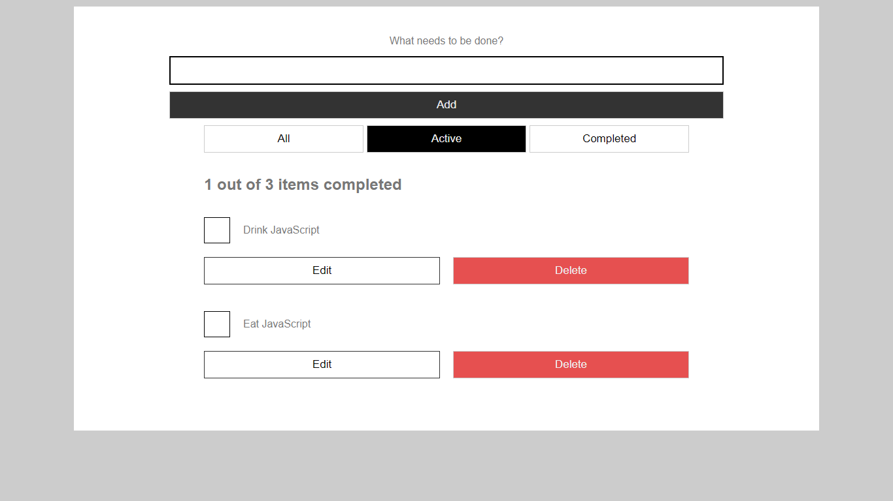
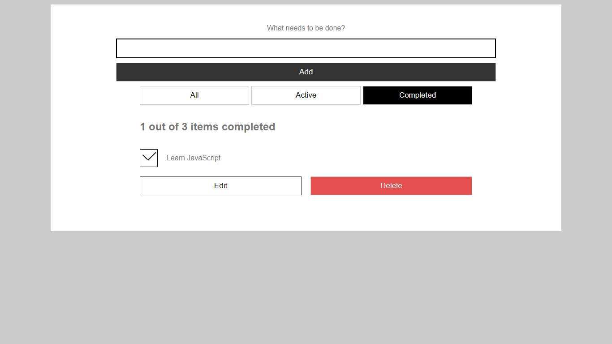
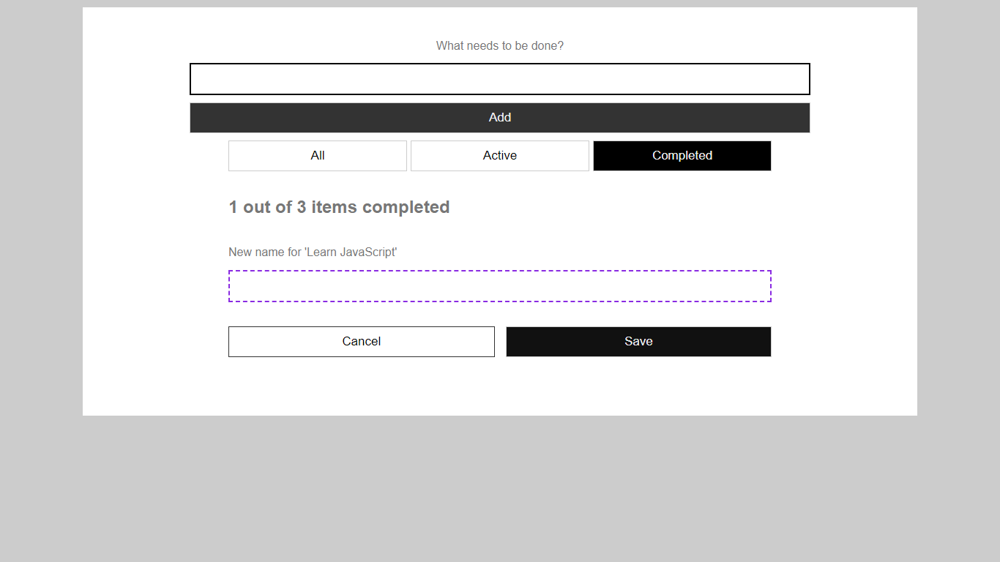

# Simple-Todo-List-App

This is a simple todo list application created with basic HTML, CSS and JAVASCRIPT
This is a project i built after learning arrays and local storage.
It's simple i know, but well, it's a start.

## Preview
### All Todos - Contains both completed and active todos

### Active Todos - These are tasks that are NOT marked as completed

### Completed Todos - These are tasks that are marked as completed

### Edit

