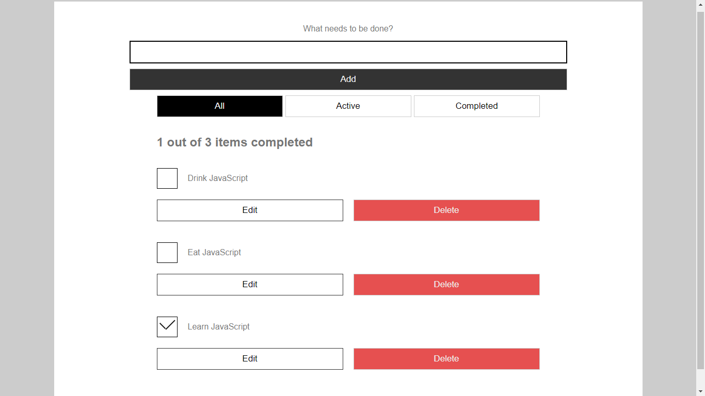

# Simple-Todo-List-App

This is a simple todo list application created with basic HTML, CSS and JAVASCRIPT
This is a project i built after learning arrays and local storage.
It's simple i know, but well, it's a start.

